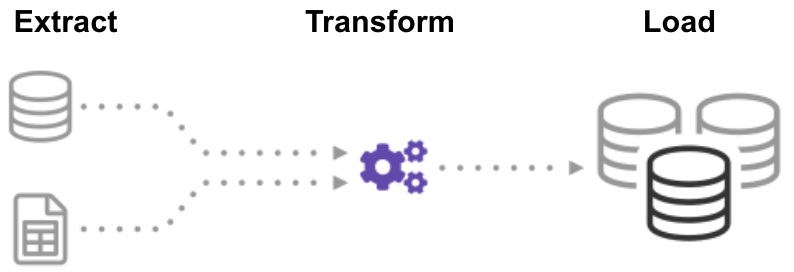
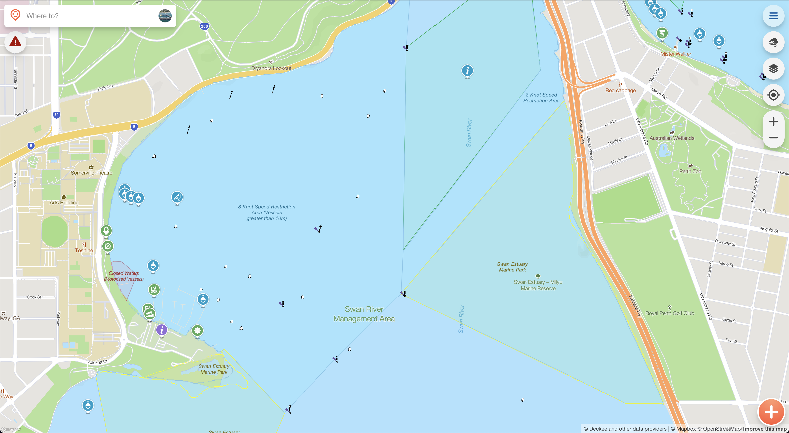

# Automating and scaling data ingestion for boating

Newcastle Cloud & DevOps 2022 - Jack McKew

* Challenges in data ingestion from many sources
* How we standardize data ingestion
* What happens after it's ingested?

---

## Quick Note

This talk is open source: <https://jackmckew.github.io/data-ingestion-automation>

---

## Who am I

I'm Jack McKew, I'm a Snr software engineer at [Deckee](deckee.com/)

I absolutely love solving problems, especially to do with DevOps! 📊

I have a blog on software, technology and more over at [jackmckew.dev](https://jackmckew.dev/)

You can reach me on:

* Twitter: [@jac_mcq](https://twitter.com/jac_mcq)
* LinkedIn: [jack-mckew](https://www.linkedin.com/in/jack-mckew/)
* GitHub: [@JackMcKew](https://github.com/JackMcKew)

---

## Projects I work on 👥 

I'm the creator & maintainer of open source packages such as:

* [Pandas_Alive](https://github.com/JackMcKew/pandas_alive)
* [awesome-python-bytes](https://github.com/JackMcKew/awesome-python-bytes)
* Numerous GitHub Actions:
    * [pyinstaller-action-windows](https://github.com/JackMcKew/pyinstaller-action-windows)
    * [pyinstaller-action-linux](https://github.com/JackMcKew/pyinstaller-action-linux)
    * [python-interrogate-check](https://github.com/JackMcKew/python-interrogate-check)

---

## Who's Deckee

[Deckee](deckee.com/) is the free boating app for local information, trip logging, weather, navigation aids and official alerts and notices

---

## Challenges in data ingestion from many sources

Note: Everything is always different and usually changes too

---

## How we standardize data ingestion

Source: https://panoply.io/data-warehouse-guide/3-ways-to-build-an-etl-process/

Note: Talk about following the ETL pattern

---

## Javascript implementation

Note: Show an integration and go through the abstractions

---

## Orchestrating ingestions

Note: Go into how it's built as endpoints within microservices and curl cron jobs are used

## What happens after it's ingested?

* Map tiles
* Markers

---

## What the user sees

---

## Live Demo 😬

---
## That's all folks

Feel free to reach out to me on:

* My Blog: [jackmckew.dev](https://jackmckew.dev/)
* Twitter: [@jac_mcq](https://twitter.com/jac_mcq)
* LinkedIn: [jack-mckew](https://www.linkedin.com/in/jack-mckew/)
* GitHub: [@JackMcKew](https://github.com/JackMcKew)
